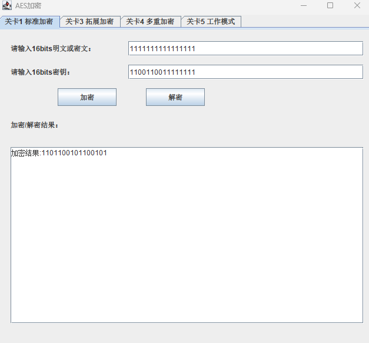
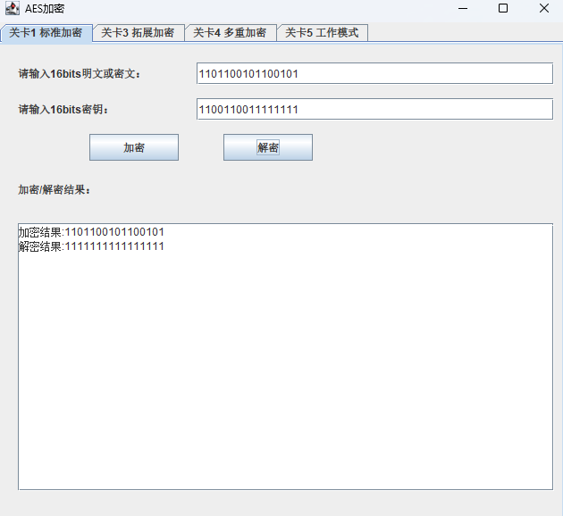
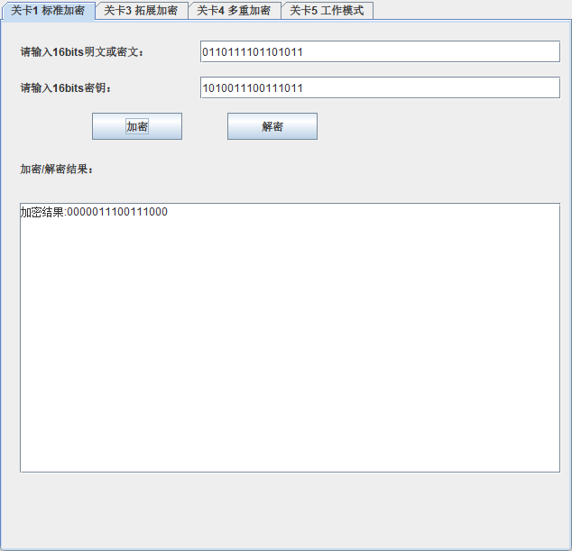
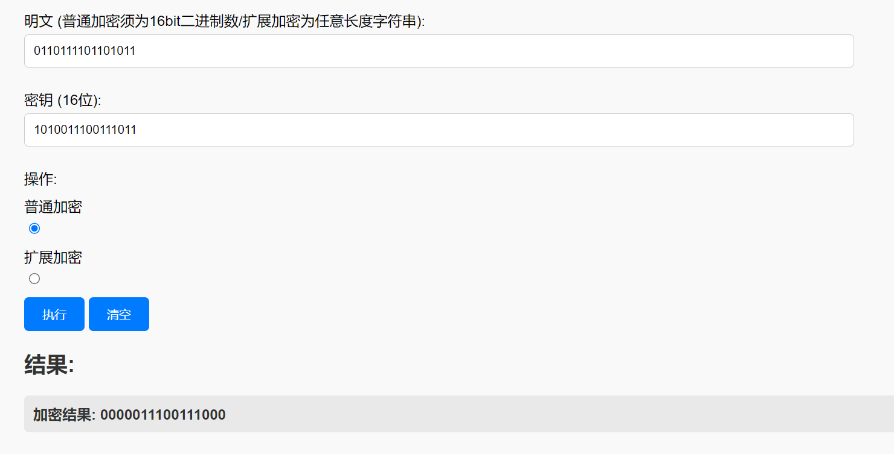
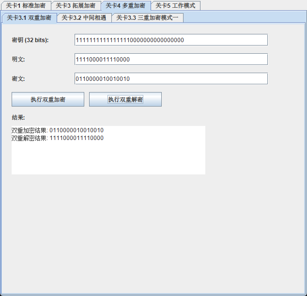
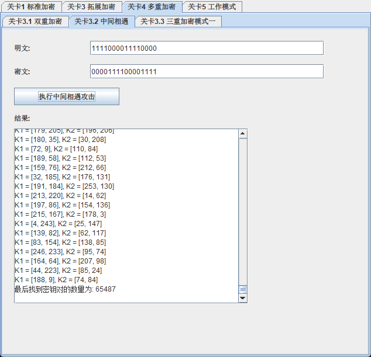
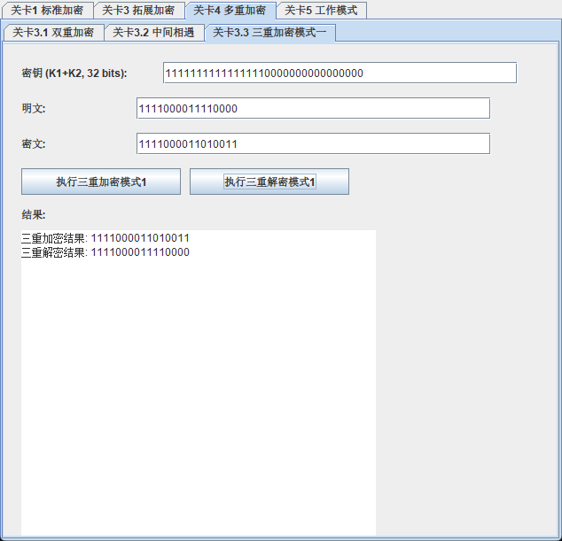
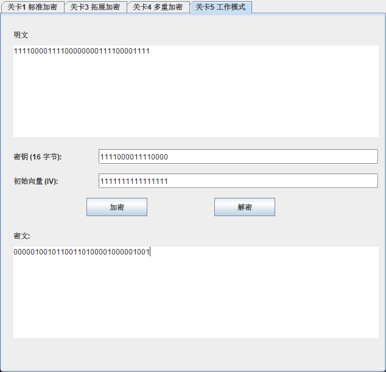
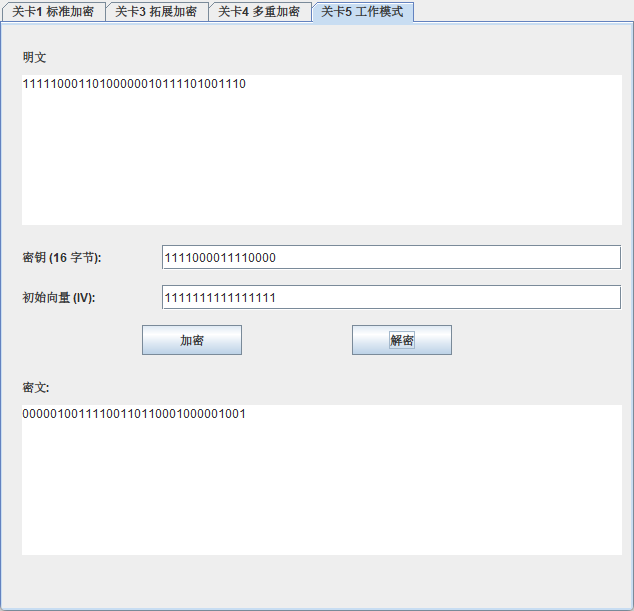

# S-AES加密算法的实现
 一个简易的AES加密算法实现，用以加深对AES算法的理解
## 一、项目结构

- 项目根目录
    - src  
      - main.java 项目主函数
      - demo
        - S_AES 加密算法实现
            - CBC.java
            - S_AES.java
            - 三重加密.java
            - 中间相遇攻击.java
            - 双重加密.java
            - 拓展.java
        - GUI 相关界面实现
            - Gui.java 总的交互界面实现 
            - test01_Panel.java 关卡一 界面实现
            - test03_Panel.java 关卡三 界面实现
            - test04_panel.java 关卡四 界面实现
            - test05_Panel.java 关卡五 界面实现
     - screenshots(项目截图) 

## 二、项目说明
### 1. 项目介绍
本实验是根据教科书《密码编码学于网络安全—原理与实践(第8版)》，附录D：简化AES 所完成  
使用Java+Java Swing实现S-AES加密和解密和图形化界面。

### 2.关卡测试
#### 关卡一.标准加密/解密
按照实验基本要求的输入格式，输入明文和密钥，格式如下：

输入：明文或密文 + 密钥  
输出：加密完成的密文 或者 解密完成的明文  

明文：16bits二进制数  
密文：16bits二进制数   
密钥：16bits二进制数

测试结果：  
  
  
  
#### 关卡二.组间测试
考虑到是"算法标准"，所有人在编写程序的时候需要使用相同算法流程和转换单元(替换盒、列混淆矩阵等)，以保证算法和程序在异构的系统或平台上都可以正常运行。
本项目已经与黎雷组完成交叉测试并通过  
本组结果
  
黎雷组的测试结果如图：
  

#### 关卡三.拓展输入
考虑到向实用性扩展，加密算法的数据输入可以是ASCII编码字符串(分组为2 Bytes)，对应地输出也可以是ACII字符串(很可能是乱码)。
输入：待加密或解密任意长度ASCII编码字符串 + 16bits密钥
输出：密文或明文  
  *注意:密钥应该为16bits*  
  *加密后极大可能出现乱码*

拓展输入输出测试结果如图:  

#### 关卡四.多重加密
##### 1.双重加解密的实现
在完成基础的加解密功能之外，还完成了双重加密功能，使用32位的密钥，将密钥分为key1和key2  
加密时，先使用key1加密明文，再使用key2加密密文，得到最终的密文  
解密时，先使用key2解密密文，再使用key1解密密文，得到最初的明文

测试结果如图：  
  

##### 2.中间相遇攻击
对给定的一组明密文对，尝试使用中间相遇的方法进行攻击  
结果显示，对一组明密文对，有四万多种密钥可以实现
  

##### 3.三重加密
与双重加密类似：使用了长为48位的密钥对明文进行三重加密，其中密钥key = key1 + key2 + key3
依次使用key1、key2、key3对明文、中间态、第二次加密得到的中间态进行加密，得到密文，解密过程则相反
 测试结果如图所示：  
  

#### 关卡五.CBC工作模式

1. 选择一个16位的随机初始向量（IV）   
2. 将较长的明文消息分成固定大小的块（16位），然后使用S-AES算法来依次加密每个块。
3. 对于第一个块，将它与初始向量进行XOR操作，然后使用S-AES进行加密。加密后的结果成为下一个块的初始向量。
4. 对于后续的块，将明文块与前一个加密块进行XOR操作，然后使用S-AES进行加密。这个过程会一直持续，直到整个消息被加密。
5. 发送加密后的消息以及最后一个加密块给接收方。
6. 接收方知道初始向量，它可以根据相同的步骤解密消息，将每个块解密并将结果与前一个块的密文进行XOR操作。
   
测试截图：
  
  
## 三、开发手册
### 1. 项目结构
- 项目根目录
    - src  
      - main.java 项目主函数
      - demo
        - S_AES 加密算法实现
            - CBC.java
            - S_AES.java
            - 三重加密.java
            - 中间相遇攻击.java
            - 双重加密.java
            - 拓展.java
        - GUI 相关界面实现
            - Gui.java 总的交互界面实现 
            - test01_Panel.java 关卡一 界面实现
            - test03_Panel.java 关卡三 界面实现
            - test04_panel.java 关卡四 界面实现
            - test05_Panel.java 关卡五 界面实现
     - screenshots(项目截图) 

### 2. S-AES算法实现
 SDES算法实现位于`src/demo/AES/S_AES.java`中。这个文件包含了SDES算法的核心实现，包括加密和解密函数。  
 
### 3.加密过程详解
#### i.密钥拓展
在S-AES加密的开始，我们首先对初始的16位密钥进行扩展，以产生所需的子密钥。   
使用expand_key函数，将初始密钥分为两个8位的部分：W0和W1。   
使用函数 g（在代码中是fun_g）对W1进行处理，然后与W0进行异或操作得到W2。   
将W2与W1进行异或操作，得到W3。
使用函数g对w3进行处理，然后与w2进行异或操作，得到w4。   
将w4与w3进行异或操作，得到w5。
#### ii.初始轮密钥加
使用add_round_key函数，将明文与子密钥w0和w1进行异或操作。   
#### iii.第一轮
半字节替代（Byte Substitution）：使用s_box（S盒）进行半字节替代。
行位移（Row Shift）：对状态矩阵进行行位移操作。   
列混淆（Mix Columns）：使用MC函数和MC_table进行列混淆操作。   
轮密钥加（Add Round Key）：使用子密钥w2和w3。
#### iv.第二轮
半字节替代（Byte Substitution）：使用s_box（S盒）进行半字节替代。   
行位移（Row Shift）：对状态矩阵进行行位移操作。
轮密钥加（Add Round Key）：使用子密钥w4和w5。
#### v.输出
最后的状态矩阵是加密的密文。   

### 4.GUI
   本项目为每一个测试都提供了GUI，方便用户使用和测试
## 四、用户指南
### 1.工具简介
S-AES（Substitution-AES）是一种对称加密算法的简化版本，主要用于教学和学习目的。  
它基于AES（高级加密标准），但采用了较小的块大小和密钥长度，以便于理解和实现。
### 2.项目安装
     https://github.com/Scndi/S-AES.git 
   打开链接，下载后用IDEA等软件打开，选择合适的jdk文件，运行main.java即可
### 3.加密操作
 -打开程序，运行main.java，输入明文和密钥，点击加密，结果会出现在下方
### 4.解密操作
 -打开程序，运行main.java，输入密文和密钥，点击解密，结果会出现在下方
### 5.注意事项
- 标准输入下：明文和密钥必须分别为16位和16位二进制数，不得包含除0和1以外的字符。
- 在拓展输入情况下，输入的密文或明文会被视为字符，转化为ASCII码进行处理。但密钥必须仍然是严格的16位二进制数。
### 6.反馈与支持

如果您遇到任何问题或需要帮助，请随时联系我们。感谢您使用SAES算法加解密工具！
祝您使用愉快！
